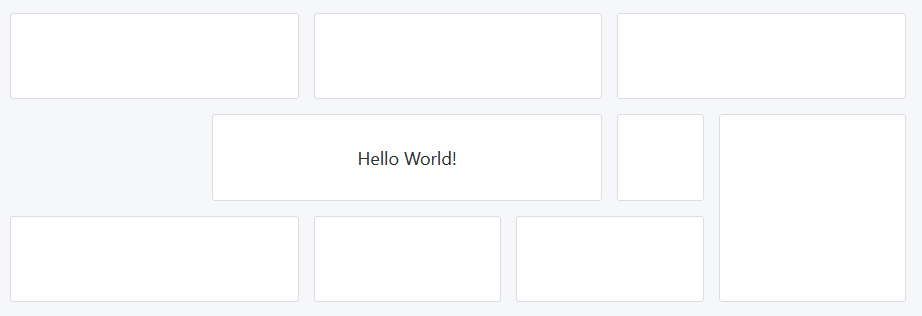
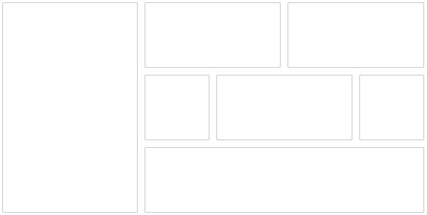

## 2019-08-27 (1.0.7)

The announced widget drawer is now implemented. This means, all available widgets (date/time, notes, web search) can be placed onto the dashboard and moved/resized within the UI. Removing the widgets is not yet possible, though.

I've added multi-language support. Currently English (default) and German are available. I've used [i18next](https://www.i18next.com/) to compare it to the more popular [react-intl](https://github.com/formatjs/react-intl) which I'm using at work. So far it's really nice to use.

I've also included [Storybook](https://storybook.js.org/) for development, a tool to preview UI components. It helped me already to find and fix some small issues. 

Animations are now disabled if the user [prefers not to see any](https://developers.google.com/web/updates/2019/03/prefers-reduced-motion).

## 2019-07-15 (1.0.6)

The first step for GUI-based dashboard customization is done: the widgets are now draggable/resizeable. The widget selection is still fixed, though, so I should implement a widget drawer soon.

I've also added a new Search widget. Right now the DuckDuckGo search engine is hard-coded, but in the future there will be a list of pre-defined providers and also the possibility to define a custom website.

Finally, I've replaced most of my (S)CSS files with a Functional CSS approach. I've used [Tailwind CSS](https://tailwindcss.com/), one of the most popular utility-first CSS frameworks. I really enjoy it so far :)

Notice: The state data is stored in the Local Storage, so you might have to clear it if you have opened the website in the past. This won't be necessary when the project is out of the work-in-progress state of course.

## 2019-05-25 (1.0.5)

There is a new widget for showing the current date and time. Additionally, the state is now persisted across the sessions. Under the hood I've added [redux-observable](https://github.com/redux-observable/redux-observable) to manage side effects and I've played around with the new [React Hooks](https://reactjs.org/docs/hooks-intro.html).

## 2019-04-22 (1.0.4)

I haven't made much functional progress in the last month as I've been mainly working on my other project: [Tip of the Day](https://tips.darekkay.com/). It is relevant to the dashboard, though, as I wish to connect both projects. The idea is to have a widget which displays a random tip every day (e.g. "country of the day"). I've also made some progress under the hood and made the text widget editable (the content is not stored yet, though).

## 2019-03-21 (1.0.3)

Now there's support for color themes! I've used CSS variables, so it's easy to switch values at runtime (try out the preview button). There's also a new shiny favicon, based on [Font Awesome 5](https://fontawesome.com/). Finally, I've introduced React's [error boundaries](https://reactjs.org/docs/error-boundaries.html) so the app doesn't crash if a single widget throws any error.

## 2019-03-20 (1.0.2)

I've implemented the first, very basic widget: Text Widget. It just displays fixed text, nothing fancy. Maybe it can be extended to support some basic formatting options in the future.

Most work happened under the hood. I've cleaned up the code and tried to establish a good framework to build upon.

## 2019-03-17 (1.0.1)

I had to make a decision: what responsive behavior should the dashboard grid follow? There are multiple approaches:

1. [Hero Panel](https://heropanel.com/) uses pixel-perfect sizings and breaks at 700px into 1x1 widgets. This makes the widgets always look good, as they are fixed-sized. However, the content is simply cut above the breakpoint if it does not fit into the viewport. Also, I prefer seeing more content than a 1x1 widget in mobile view.

2. Use a [masonry](https://masonry.desandro.com/) layout. This approach makes sure to place all widgets optimally at all breakpoints. This is great for content where the order doesn't matter. However, on a dashboard I don't want my widgets to move around auto-magically.

3. Let the user define the layout for each breakpoint. Meh, too much work for the user.

4. Make the widgets fluid and break into a single column at 767px ([example](https://colorlib.com/polygon/adminator/index.html)). Also add a max width to prevent over-stretching the content.

I think that #4 is the best trade-off.

I've implemented a simple Dashboard using CSS Grid. The user may define the number of columns and rows and assign a relative width and height for each widget. In the future, this should be configurable within the UI (drag and drop), but for a MVP this is enough.

## 2019-03-14 (1.0.0)

The journey begins :rocket:

With zero practical TypeScript experience, I've had some issues setting up the project, despite using a [boilerplate](https://github.com/facebook/create-react-app). To get started, I've migrated three common JS components from my other app (button, link, icon). I've checked some best practices and popular Typescript/React projects, trying to do it the right way™ (e.g. correct types).

I'm really looking forward to experiencing the praised improvement over vanilla JavaScript. My IDE of choice, IntelliJ IDEA, supports TypeScript types for popular projects, so I've already got a good IntelliSense even without TypeScript .

The [CI pipeline](https://travis-ci.org/darekkay/dashboard) is on and the project is already [live](https://dashboard.darekkay.com) (not much is going on, though).
