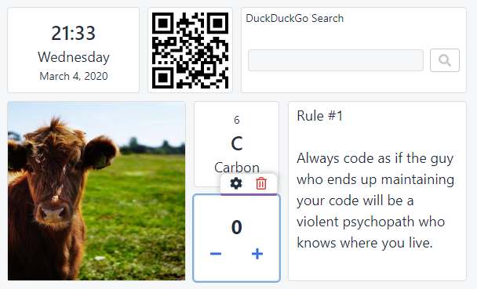

# 2020-03-04 (1.1.5)

## Edit mode redesign

8/10 of my testers found the "edit mode" confusing and unnecessary. From user perspective, I agree: why can't I just drag and drop the widgets without entering an "edit mode"? The challenge was to make it work reliably without sacrificing the simple UI. For example, I like the `Text` widget's full-size behavior, which makes implementing drag'n'drop more difficult, though.

One common pattern is to use a fixed header for every widget and use it as a drag handler. I've tested this approach, but I _really_ dislike cluttering the UI with otherwise unnecessary headers.

Instead, I've got inspired by [Ryeboard](https://www.ryeboard.com/). All widgets contain an overlay that makes them movable/resizable by default. To access the widget itself, the user has to click it once (without dragging). I think this solution has the best trade-off between good UX and simple UI.

## Other changes

This release contains several small UI improvements:

- After the edit mode redesign, I've also reworked the widget button bar and made it keyboard-accessible.
- Configuration modals will now be saved on pressing Enter within any input field.
- When starting Dashboard for the first time, the default theme (light/dark) will depend on the user's system preference.
- Moving widgets around had often lead to a mess. As a workaround, I've activated a "vertical compact mode". This means, widgets will "stick" vertically, leaving no gaps. While it makes the widget placement more strict, it will lead to less overall frustration.

Apart from that, I've been doing lots of maintenance and code improvement stuff:

- I've extracted shared styles into a [separate package](https://www.npmjs.com/package/@darekkay/styles). This was inspired by Kent C. Dodds' [blog post](https://kentcdodds.com/blog/concerning-toolkits).
- I've included some more [sanitize.css](https://csstools.github.io/sanitize.css/) rules. For example, Buttons now use the same font as the rest of the app.
- I did a big color palette refactoring. If you don't see any difference, I did a good job. In summary, I'm now using colors from the [U.S. Web Design System](https://designsystem.digital.gov/design-tokens/color/system-tokens/), which have a very special accessibility property. It is a big and interesting topic on its own, which screams for a separate blog post.
- I've also spent some time making the focus indicator accessible everywhere. I've summarized my lessons learned in [a new blog post](https://darekkay.com/blog/accessible-focus-indicator/).
- A new [react-grid-layout](https://github.com/STRML/react-grid-layout) release brings some great improvements. Mainly, the widgets don't rerender anymore on breakpoint changes (so widget state is persisted). Unfortunately, it has another critical bug. I've provided a fix, but it may take some time to get it merged and released, so I've forked the project. Fortunately, npm makes it trivial to replace any package with a GitHub URL.
