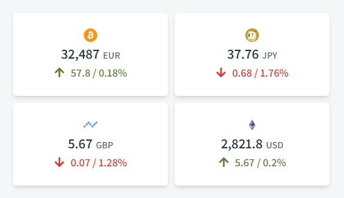

# 2020-xx-xx (1.2.0)

## Server module

I've tried to develop the Dashboard as a client-only web application for as long as possible. But now that I've started including 3rd party data dependencies, I was experiencing CORS issues. Jup, you cannot fetch many resources (like calendar feeds) directly, but you can write a server and just pass through the request. I understand the security implications, but from DX (developer experience), this is inconvenient.

Of course, I knew that I will have to write a server _someday_ (e.g. to "hide" private keys for 3rd party APIs or to implement a login feature). I just didn't expect it to happen so soon. But maybe it's the perfect timing since [Apple is killing PWAs](https://ar.al/2020/03/25/apple-just-killed-offline-web-apps-while-purporting-to-protect-your-privacy-why-thats-a-bad-thing-and-why-you-should-care/).

## Cryptocurrencies widget

The first widget that uses the new server module is Cryptocurrencies. It displays the current market price and its 24h trend. The data updates automatically every 15 minutes. It uses the awesome [CoinGecko API](https://www.coingecko.com/).

## Backup & Restore

It's now possible to export&import all user data. This enables multiple things:

1. Data backup. The data is your and every user has the right to download it.
2. Manual syncing user data across computers (until the new server module provides a more user-friendly alternative).
3. Create and save different use cases. That's nice both for development and showcases.

## Maintenance

The changelog looks small, but a lot refactorings and improvements happened under the hood.

Amongst others, I've split the project into 3 independent modules: `app`, `server` and `docs`. This led to a new blog post for [configuring GitLab CI for monorepos](https://darekkay.com/blog/gitlab-ci-monorepo-config/).
